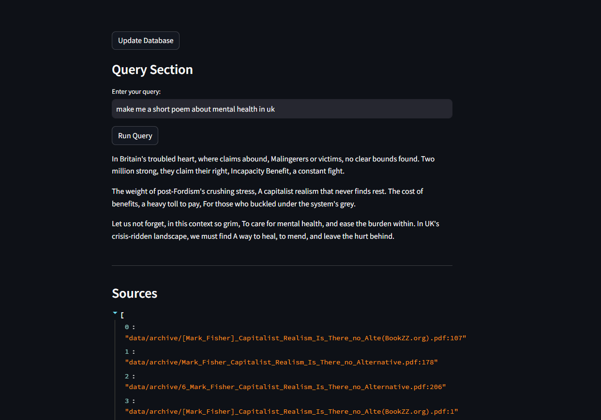

# Local RAG System with Ollama

This project implements a Retrieval-Augmented Generation (RAG) system using Ollama locally, with a simple GUI built using Streamlit. It features the ability to update a persistent vector database and uses the Llama3 7B model. Also integrates with Paperless-ngx for document management and easy OCR.

Ollama need to be installed locally.

## Installation

1. Install the required dependencies:
   ```
   pip install -r requirements.txt
   ```

2. Set up your environment:
   - Set the `BASE_DIR` environment variable to the directory containing your documents.
   - If using with Paperless-ngx, set up your credentials (see Configuration section).

3. Start the application:
   ```
   streamlit run app.py
   ```

4. Open your web browser and navigate to `http://localhost:8501`.

---



---


## TODO

- [ ] Reduce dependencies
- [ ] Improve RAG implementation
- [ ] Update bien

